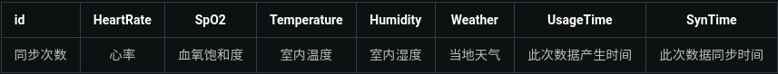

# 毕设
## 智能座椅功能规划
1. 心率
2. 血氧饱和度
3. 室内温度
4. 室内湿度
5. 当地天气
6. 音乐

7. 按摩
8. 心电图

## 智能座椅系统搭建规划

### 端口分发

使用原因：在客户端建立ssh反向代理的时候需要监听服务端端口，多客户端时容易产生端口冲突

PortDistribute 要用su权限执行，（lsof -i:port）

### 网页端
1. 树莓派本地保留数据库，完成一次功能再进行服务器端数据同步
2. 每个设备定制唯一识别二维码(http://domin.com/smartchair/uid)
3. 服务端给每个uid(设备)建立对应的数据表(tablename:uid).参考db.1
4. 推送心率，血氧饱和，心电图周报
5. 强制实时拉取数据
6. 查看历史数据

### app

约等于网页端，只不过不用扫二维码，不支持ios

### 嵌入式显示器

## 数据库(MySQL)
db.1
  

## 访问地址
```
http://123.206.64.174/dist/#/pages/dashboard/uuid
http://127.0.0.1:4200/#/pages/dashboard/uuid

```
例如
```
http://127.0.0.1:4200/#/pages/dashboard/UuidExample
http://123.206.64.174/dist/#/pages/dashboard/UuidExample
```
## 示例数据访问二维码
1. 本地

  

2. 服务器

  


## 项目命令
1. 开机启动(服务器和树莓派都应该将run.sh注册到开机启动)
```
echo run.sh >> /etc/rc.local
```
2. 环境变量
  - TTS
  ```
  nano /etc/profile
  export LD_LIBRARY_PATH="/home/pi/BiYeSheJi/client/tts/libs/RaspberryPi"

  # 开机启动的时候由init监护
  nano /root/.bashrc
  export LD_LIBRARY_PATH="/home/pi/BiYeSheJi/client/tts/libs/RaspberryPi"
  ```

```
1. 运行 : npm start
2. 安装 : npm install
3. 发布 : ng build --prod --aot
```

## 注意
1. 启动树莓派上C工程请用su权限
2. 重新配置环境之后请检查 clent/include/Unique.h 文件中的定义
